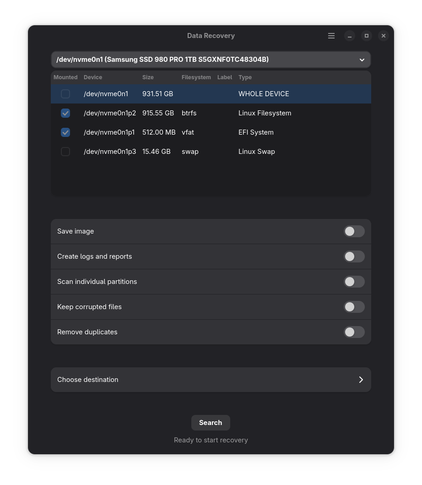

# datarecovery

<p align="center">
  
</p>

**Work in progress but fully functional.** 

A GTK4/Libadwaita application for data recovery using ddrescue and PhotoRec. Recovers all files (not just deleted ones) from storage devices or disk images, organises them by file type, and optionally removes duplicates.

**Important**: Requires significant disk space as images are created first, then files recovered from those images. If whole disk is selected and option to additionally scan individual partitions chosen, double the space is needed.

## Process

1. **Source Selection**: Choose a storage device or existing disk image file
2. **Mount Safety**: Automatically detects and handles mounted partitions to prevent corruption
3. **Imaging**: Creates images using 4 passes of ddrescue (details below)
4. **File Recovery**: PhotoRec performs data recovery
5. **File Organisation**: Automatically sorts recovered files by type into organised folders

### User Options
- **Save Images**:
- **Enable Detailed Logging**:
- **Remove Duplicates**: Uses rdfind to remove duplicate files
- **Keep Corrupted Files**:
- **Scan Individual Partitions**: If whole drive selected, option to additionally scan all partitions individually for maximum recovery

### ddrescue 4-Pass details
1. **Pass 1 - Fast Copy**: Quick sequential read without retries to capture easily readable data
2. **Pass 2 - Direct Access Retry**: Up to 3 retry attempts using direct I/O to bypass system caching
3. **Pass 3 - Reverse Retry**: Read failed sectors in reverse order to minimise mechanical stress
4. **Pass 4 - Final Scraping**: Final attempt with scraping mode for stubborn sectors

## Installation

### From Source (meson)

1. Install dependencies: `sudo zypper install meson ninja python3-gobject gtk4 libadwaita gnu_ddrescue photorec rdfind udisks2 polkit`
2. Clone the repository: `git clone https://github.com/koxt2/datarecovery.git`
3. Build and install:
  ```bash
  meson setup builddir
  meson compile -C builddir
  sudo meson install -C builddir
  ```

### Prebuilt Binaries (openSUSE Build Service)

You can download and install prebuilt packages from...

[openSUSE Build Service: home:koxt2:datarecovery](https://build.opensuse.org/project/show/home:koxt2:datarecovery)

## Acknowledgments

**GTK4/Libadwaita** - Modern Linux desktop integration (<a href="https://gnome.pages.gitlab.gnome.org/libadwaita/" target="_blank">link</a>)

**UDisks2** - Reliable device management interface (<a href="https://github.com/storaged-project/udisks" target="_blank">link</a>)

**GNU ddrescue** - Core imaging technology (<a href="https://www.gnu.org/software/ddrescue/" target="_blank">link</a>)

**PhotoRec/TestDisk** - File recovery capabilities (<a href="https://www.cgsecurity.org/wiki/PhotoRec" target="_blank">link</a>)

**rdfind** - Used for duplicate file detection and removal (<a href="https://github.com/pauldreik/rdfind" target="_blank">link</a>)

## License

GPL-2.0-or-later - See COPYING file for full license text.


